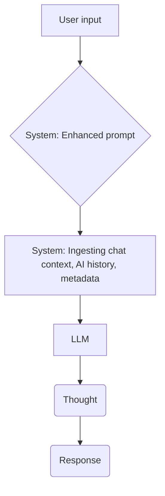

```mermaid
graph TD
    A[User input] --> B{System: Enhanced prompt};
    B --> C[System: Ingesting chat context, AI history, metadata];
    C --> D[LLM];
    D --> E(Thought)
	E --> F(Response);
```