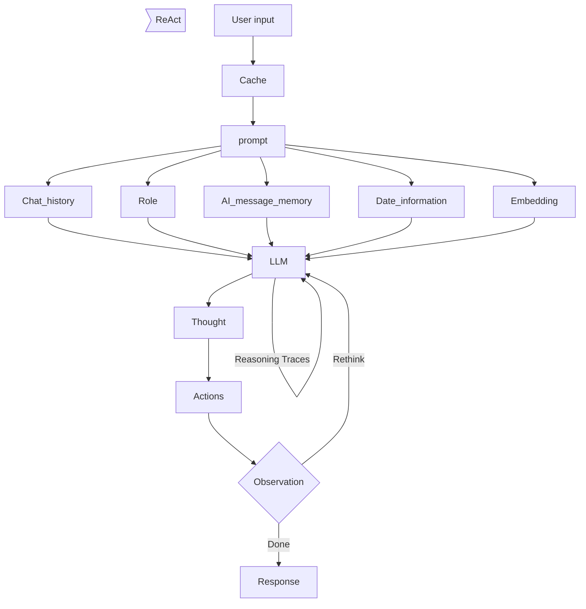

# GPT
## [ReAct model](https://react-lm.github.io/)

```mermaid
graph TD
    label>ReAct]
    A[User input] --> Cache[Cache]
    Cache --> B[prompt]
    B --> Chat_history[Chat_history]
    B --> Role[Role]
    B --> AI_message_memory[AI_message_memory]
    B --> Date_information[Date_information]
    B --> Embedding[Embedding]
    Chat_history --> D[LLM]
    Role --> D
    AI_message_memory --> D
    Date_information --> D
    Embedding --> D
    D -->|Reasoning Traces| D
    D --> E[Thought]
    E --> F[Actions]
    F --> G{Observation}
    G -->|Done| H[Response]
    G -->|Rethink| D
```